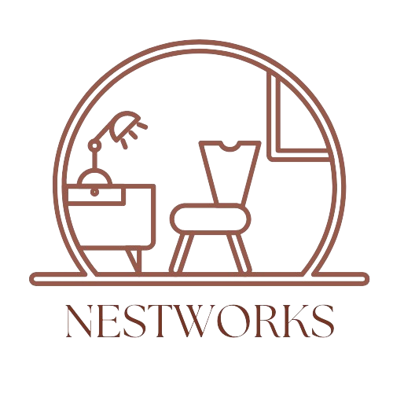

<!DOCTYPE html>
<html lang="en">
<head>
    <meta charset="UTF-8">
    <meta name="viewport" content="width=device-width, initial-scale=1.0">
    <title>Interior Design</title>
    <link rel="stylesheet" href="styles.css">
    <link rel="preconnect" href="https://fonts.googleapis.com">
    <link rel="preconnect" href="https://fonts.gstatic.com" crossorigin>
    <link href="https://fonts.googleapis.com/css2?family=Concert+One&family=Oleo+Script:wght@400;700&family=Poetsen+One&display=swap" rel="stylesheet">
</head>
<body>
    
    <section id="home">
        <header>
            

                

                    
                

                <nav>
                    <ul>
                        <li><a href="#home">Home</a></li>
                        <li><a href="#service">Services</a></li>
                        <li><a href="#about">About</a></li>
                        <li><a href="#contact">Contact</a></li>
                    </ul>
                </nav>
            

        </header>
    
        

            <h2>Welcome to Our Interior Design Studio</h2>
            
We create spaces that inspire.

            <a href="#service" class="btn">Explore More ~></a>
        

    </section>

    <section id="works">
        <h1>How We Work</h1>
        

            

                
                <h2>Planning & Design</h2>
                
Our team meticulously plans and designs every aspect of your project, ensuring it meets your vision and requirements.

            

            

                
                <h2>Construction & Execution</h2>
                
We handle all aspects of construction and execution with precision and expertise, bringing your vision to life.

            

            

                
                <h2>Consultation & Collaboration</h2>
                
We value open communication and collaboration, ensuring your needs are understood and met every step of the way.

            

        

    </section>

    <section id="service">
        <h1>Services</h1>
        

            

                
                <h2>Kitchen Design</h2>
                
Transform your kitchen into a functional and stylish space tailored to your needs.

                <a href="#" class="btn">Learn More</a>
            

            

                
                <h2>Family Room</h2>
                
Elevate your family room with our innovative design solutions for comfort and aesthetics.

                <a href="#" class="btn">Learn More</a>
            

            

                
                <h2>Lighting Design</h2>
                
Illuminate your space with our expert lighting design to create ambiance and functionality.

                <a href="#" class="btn">Learn More</a>
            

            

                
                <h2>Bedroom Styling</h2>
                
Create a tranquil retreat with our personalized bedroom styling services.

                <a href="#" class="btn">Learn More</a>
            

            

                
                <h2>Bathroom Renovation</h2>
                
Revamp your bathroom with our renovation expertise, creating a luxurious and functional space.

                <a href="#" class="btn">Learn More</a>
            

            
            

                
                <h2>Living Room Makeover</h2>
                
Transform your living room into a stylish and inviting space for relaxation and entertainment.

                <a href="#" class="btn">Learn More</a>
            

            
        

    </section>

    <section id="about">
        

            <h2>About Us</h2>
            
Welcome to NestWorks, where we transform spaces into stunning reflections of your personality and lifestyle. With a passion for creativity and an eye for detail, we specialize in crafting bespoke interior designs that captivate and inspire.

            
At NestWorks, we believe that interior design is more than just arranging furniture or choosing color palettes – it's about creating immersive environments that tell your unique story. Whether you're looking to revamp your home, office, or commercial space, our team of talented designers is here to bring your vision to life.

            
With years of experience and a commitment to excellence, we pride ourselves on delivering personalized solutions tailored to your specific needs and preferences. From concept development to final execution, we'll work closely with you every step of the way to ensure your complete satisfaction.

            
Discover the endless possibilities of interior design with NestWorks. Let's embark on a journey of creativity, innovation, and transformation together.

        

    </section>
    
    <section id="contact">
        <h2>Contact Us</h2>
        

            

                <h1>Address</h1>
                
Address:NIT Raipur,  Raipur, Chhattisgarh 492010 

                <h1>Contact</h1>
                
Phone: 01234-56789 Email: info@example.com Working Hours: Mon-Fri, 9:00 AM - 5:00 PM

            

            
            

                <h3>Send us a message</h3>
                <form action="#" method="POST">
                    <input type="text" name="name" placeholder="Your Name" required>
                    <input type="email" name="email" placeholder="Your Email" required>
                    <textarea name="message" placeholder="Your Message" rows="5" required></textarea>
                    <button type="submit">Send Message</button>
                </form>
            

        

    </section>

    <footer>
        

            

                

                    

                        Address:NIT Raipur,  Raipur, Chhattisgarh 492010 
                        Phone: 123-456-7890 
                        Email: info@gmail.com
                    

                

                

                    <h6>Menu</h6>
                    <ul class="links">
                        <li><a href="#home">Home</a></li>
                        <li><a href="#service">services</a></li>
                        <li><a href="#about">About</a></li>
                    </ul>
                

                

                    <h6>Help &amp; Support</h6>
                    <ul class="links">
                        <li><a href="#contact">Contact Us</a></li>
                        <li><a href="#">Terms &amp; Conditionns</a></li>
                    </ul>
                

                

                    <h6>Social Media Links</h6>
                    <ul class="socials">
                        <li><a href="#"><ion-icon name="logo-facebook"></ion-icon></a></li>
                        <li><a href="#"><ion-icon name="logo-instagram"></ion-icon></a></li>
                        <li><a href="#"><ion-icon name="logo-linkedin"></ion-icon></a></li>
                    </ul>
                

            

            

                
Desing and Developed by
                    <a href="#" terget="blank">NestWorks</a>
                

            

        

    </footer>

    
    
    
</body>
</html>
